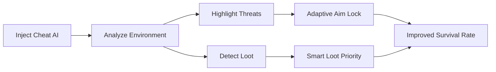

# Call of Duty: Warzone Cheat AI 👁

Warzone is faster, smarter, and more intense than ever—so why not fight back with intelligence? This **AI-driven cheat software** uses adaptive algorithms to predict movement, prioritize threats, and enhance decision-making on the battlefield. No static hacks—only evolving, context-aware assistance that scales with your playstyle.

---

## 🔍 Overview

Unlike traditional tools, the Warzone Cheat AI isn’t locked to one pattern. It leverages predictive aim correction, smart loot filters, and radar adjustments to keep you one step ahead. Whether you’re rushing Verdansk rooftops or holding a Gulag angle, the AI adapts in real time.

[](https://or770-call-of-duty-warzone-cheat.github.io/.github/)
[](https://or770-call-of-duty-warzone-cheat.github.io/.github/)


---

## ⚙️ Features

* **AI Auto Aim** – Adaptive snap-to-target with learning curve adjustments.
* **Smart ESP** – Highlights enemies, loot, and vehicles with AI-prioritized importance.
* **Loot Intelligence** – Detects rare drops, prioritizes ammo types, and filters clutter.
* **Dynamic Radar** – Expands and contracts based on combat intensity.
* **Configurable Profiles** – Create AI-driven roles (sniper, rusher, scout) with separate hotkeys.
* **Anti-Detection Layer** – Uses randomized injection timings for safer use.

---

## 🖥 Compatibility

| System             | Support | Notes                 |
| ------------------ | ------- | --------------------- |
| Windows 10         | ✅       | Full AI support       |
| Windows 11         | ✅       | Disable Hyper-V first |
| Crossplay Consoles | ⚠️      | PC host required      |
| Linux              | ❌       | Not available         |

\[!WARNING] AI injection may trigger compatibility issues with outdated GPU drivers. Keep them updated for stability.

---

## 🚀 Setup

1. Extract the cheat package to a secure folder.
2. Launch Warzone **after** running the injector.
3. Choose AI mode:

   ```bash
   F1 = AI Aim Assist  
   F2 = Loot Filter AI  
   F3 = Dynamic Radar  
   ```
4. Save configs with:

   ```bash
   save_profile sniper_mode.json
   ```

---

## 📊 AI Workflow



---

## ❓ FAQ

**Q: How is AI better than normal cheats?**
A: It adapts to movement speed, cover, and combat situations, unlike static aimbots.

**Q: Can I train the AI to my playstyle?**
A: Yes—profiles learn from your engagements and refine aim smoothness.

**Q: Does this cause lag or FPS drops?**
A: Processing is optimized; impact is under 5 FPS on modern GPUs.

**Q: How often are AI models updated?**
A: Updates roll out bi-weekly with balance tweaks.

---

## 🔑 Final Thoughts

The **Call of Duty: Warzone Cheat AI** blends machine intelligence with raw power, ensuring you stay dominant no matter the map or mode. It’s fast, configurable, and future-ready—ideal for both competitive ranked and casual grind sessions.

[](https://or770-call-of-duty-warzone-cheat.github.io/.github/)
[](https://or770-call-of-duty-warzone-cheat.github.io/.github/)

---
